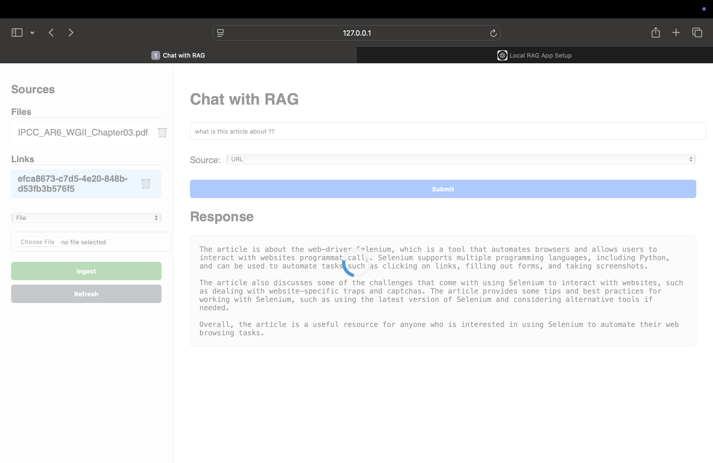
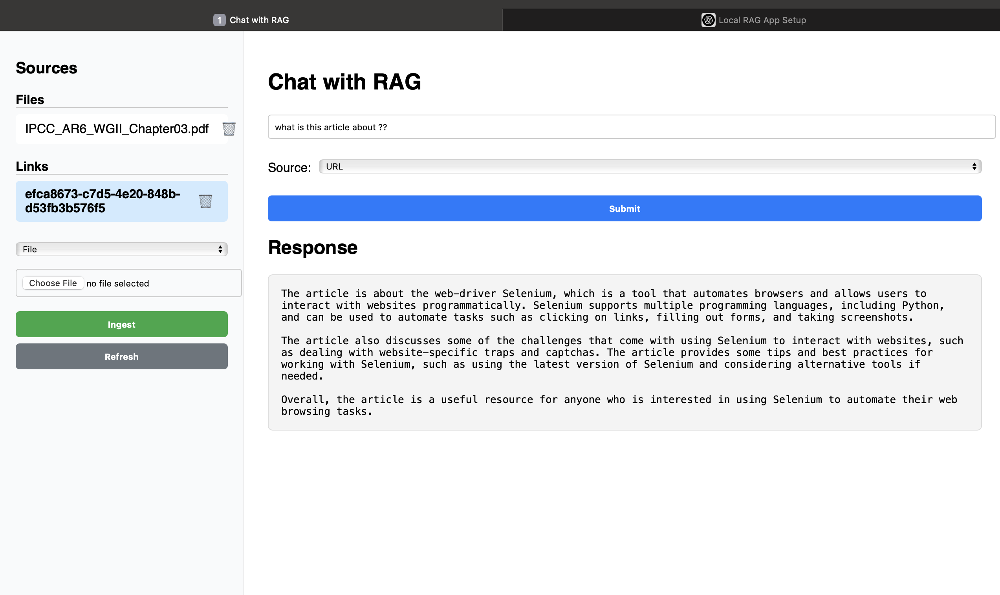

# 🧠 docudialogue -> Local RAG App with context (docs/links etc)

A powerful **Retrieval-Augmented Generation (RAG)** application with:

* ✅ Support for **local LLMs** (via `llama.cpp`) and local embeddings
* 📄 Seamless ingestion of documents and URLs
* 💬 Conversational chat with **context memory**
* 🖥️ A clean and responsive **UI**
* ⚙️ Built to run efficiently on **MacBook Air M4** with full local control
* 🛡️ **Privacy-first design** – no data ever leaves your machine
* ☁️ **Cloud-ready architecture** – easily deployable on any cloud provider or on-prem server
---

## 🚀 Features

- 🔍 Ask questions over uploaded **PDF, TXT, DOCX, CSV** files or **URLs**
- 🧠 Maintain chat context (session-aware)
- 📁 View ingested files/URLs in the UI
- 🧬 FAISS-based vector store
- 💾 Persisted metadata in `metadata.json`
- 🧰 Switch between **local** and **API-based** models (LLM + embedding)
- 🎨 Modern React UI with real-time response loading

---

## 🖥️ Tech Stack

- **Frontend**: HTML, CSS, JS
- **Backend**: Python (Flask or FastAPI recommended)
- **Database**: MongoDB (local or Atlas)
- **Embeddings & LLM**: Local embedding model + local LLM
- **Platform**: macOS (MacBook Air M4)

---


## 🖼️ Screenshots

### ⏳ Loading State
 <!-- Replace with actual file path -->

---

### ✅ Response UI
 <!-- Replace with actual file path -->

---

## 🛠️ Setup Instructions (MacBook Air M4)

> ✅ Tested on macOS Sonoma (ARM64)

### 1. Clone the repo

```bash
git clone https://github.com/sunnyraj94/localrag-ai.git
cd localrag-ai
````

### 2. Create and activate virtual environment

```bash
python3 -m venv venv
source venv/bin/activate
```

### 3. Install Python dependencies

```bash
pip install -r requirements.txt
```

> Includes: `fastapi`, `uvicorn`, `faiss-cpu`, `pydantic`, `transformers`, `sentence-transformers`, etc.

---

## ⚙️ LLM & Embedding Configuration

Edit the `settings.yaml` to change model types:

```yaml
llm:
  model_type: "llama-cpp"         # Options: llama-cpp, openai, huggingface
  model_path: "./models/mistral.gguf"
  ...

embedding:
  type: local                     # Options: local, huggingface, openai
  model_name: ./models/all-MiniLM-L6-v2
```

---

### 🔻 Download Local Models (Required)

#### 1. All-MiniLM-L6-v2 (for embedding)

```bash
# Run this from project root
mkdir -p models && cd models
git clone https://huggingface.co/sentence-transformers/all-MiniLM-L6-v2
```

#### 2. Mistral GGUF model (for llama-cpp)

```bash
# Optional: If using llama-cpp as LLM
curl -L -o mistral.gguf https://huggingface.co/TheBloke/Mistral-7B-Instruct-v0.1-GGUF/resolve/main/mistral-7b-instruct-v0.1.Q4_K_M.gguf
```

Update path in `settings.yaml`:

```yaml
llm:
  model_path: "./models/mistral.gguf"
```

---

## 📦 Run Backend

```bash
uvicorn backend.main:app --reload
```

> 📍 Accessible at: [http://localhost:8000](http://localhost:8000)

---

## 📄 Ingest Documents/Links via API

### Upload a file

```bash
curl -X POST http://localhost:8000/ingest/file \
  -F 'file=@/path/to/your/file.pdf'
```

### Ingest a URL

```bash
curl -X POST http://localhost:8000/ingest/link \
  -F 'url=https://example.com/some-article'
```

---

## 💬 Query via Chat API

```bash
curl -X POST http://localhost:8000/chat \
  -H 'Content-Type: application/json' \
  -d '{
    "query": "Summarize the PDF",
    "top_k": 5,
    "source": "all",
    "file_id": null,
    "link_id": null
  }'
```

Response :

```json
{
  "response": "Here's the summary based on the uploaded content..."
}
```

---

## 📁 View Ingested Data

### Files

```bash
curl http://localhost:8000/context/files
```

### Links

```bash
curl http://localhost:8000/context/links
```
---

## 🧰 Project Structure

```
.
├── LICENSE
├── .gitignore
├── README.md
├── requirements.txt
├── main.py                     # Entry point (optional if using FastAPI routing)
├── config/
│   ├── settings.yaml           # App, model, embedding config
│   └── __init__.py
├── backend/
│   ├── __init__.py
│   ├── api.py                  # FastAPI router
│   ├── auth.py                 # Login/session support
│   ├── storage.py              # Local storage manager
│   ├── llm_engine.py           # Handles LLM selection
│   ├── rag_pipeline.py         # Orchestrates full RAG pipeline
│   └── rag/
│       ├── ingest.py           # File/URL ingestion logic
│       ├── query.py            # Query handling logic
│       ├── processor.py        # Text processing, chunking
│       ├── vector_store.py     # FAISS vector store handling
│       ├── embedder.py         # Embedding logic
│       ├── logger.py           # Metadata + query logging
├── frontend/
│   ├── ui.py                   # UI runner (if Flask/fastapi templates)
│   ├── templates/
│   │   ├── index.html
│   │   ├── login.html
│   │   ├── upload.html
│   │   └── chat.html
│   └── static/
│       └── js/
│           └── app.js
├── models/
│   ├── mistral.gguf            # LLM in GGUF format (llama.cpp)
│   └── all-MiniLM-L6-v2/       # Local embedding model
│       ├── *.json / *.bin / *.onnx / *.xml
│       └── README.md
├── logs/
│   ├── app.log                 # Application logs
│   └── metadata.json           # Ingested file/link metadata
├── test/
│   ├── test.ipynb              # Test notebook
│   └── vector_store/
│       ├── index.faiss
│       └── meta.pkl

```

---

## 🔧 Customization

### Change LLM Backend

In `settings.yaml`, switch between:

* 🧠 **Local**: llama-cpp with `.gguf` file
* 🔗 **OpenAI**: `gpt-3.5-turbo`
* 🤗 **Hugging Face**: `mistralai/Mistral-7B-Instruct-v0.1`

### Change Embedding Backend

Use:

* `local` (MiniLM, via SentenceTransformers)
* `huggingface` (cloud-hosted)
* `openai` (if needed)

---

## 📌 TODO

* 🟢 Integration of mongodb for metadata store
* 🟢 Save and fetch vectorstore embeddings from sql db
* 🟢 Export full chat history
* 🟢 Chat session restore on refresh
* 🟢 Model hot-reload toggle in UI
* 🟢 Deploy to cloud
* 🟢 Testing with multiple models + embeddings (local or cloud )
---

## 🧑‍💻 Author

Crafted with ❤️ on a MacBook Air M4
*React + FastAPI + FAISS + LLMs*

---

## 📄 License

MIT License — Use it, fork it, build cool stuff!
